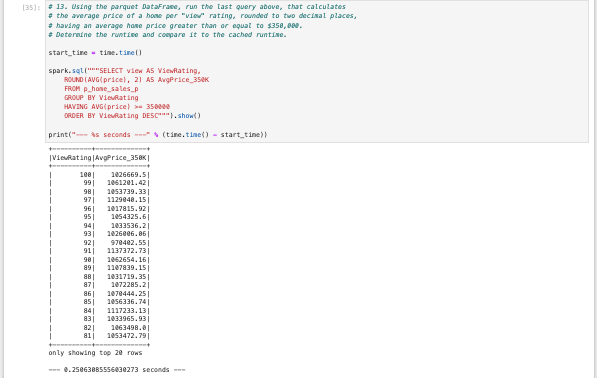

# Home Sales Analysis

## Description
In this analysis, I used SparkSQL to determine key metrics about home sales data. Then I used Spark to create temporary views, partition the data, cache and uncache a temporary table, and verified that the table was uncached.

## Installation
findspark, SparkSession, time and python

## Usage
Run the Home_Sales.ipynb in Jupyter Notebook, JupyterLab or VS Code.

